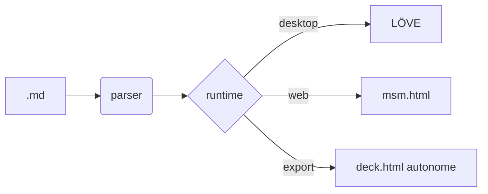

# mSM

### .md Slide Machine

Un moteur de présentation minimal, écrit en Lua !


---


## Pourquoi ?

- Écrire des slides comme on écrit des notes
- Un seul fichier `.md`, versionnable
- Démarre en une seconde
- Pas de build, pas de CSS


eee


---


## Format

En-tête YAML simple, puis du markdown.

Les slides sont séparées par une ligne `---`.

```
# Titre
## Sous-titre
- Puce

```


---


## Images


*(mettez une image dans `assets/` pour la voir ici)*


---


## Citations

> La simplicité est la sophistication suprême.

— attribué à Léonard de Vinci


---


## Inline markdown

Vous pouvez mettre du **gras**, de l'*italique*, du `code`, du ~~barré~~ et des [liens](https://love2d.org).

- Une puce avec **un mot fort**
- Une puce avec `une_fonction()` et *nuance*
- Combinaisons comme ***gras-italique*** sont gérées

> Citation avec **emphase** et `code` inline.

-> Paragraphe "note" préfixé par `->`, légèrement coloré.

-> Utile pour les réponses, *annotations* ou pensées secondaires.

  -> Indenter avec des espaces avant `->` pour un niveau secondaire.

    -> Deux niveaux d'indentation, etc.


---


## Transitions

Au choix dans l'en-tête :

- `fade`  — fondu enchaîné
- `slide` — glissement horizontal
- `push` — pousse + fondu
- `none` — coupe franche


---


## Tables

| Feature      | mSM   | Reveal.js | Marp    |
| ------------ | :---: | :-------: | :-----: |
| Format       |  md   |    md     |   md    |
| Runtime      |  Lua  |  JS/Web   |   CLI   |
| Dépendances  |   1   |    ++     |    +    |
| Transitions  |  oui  |   oui     | partiel |

*Note : les emojis (✅, ⚠️, …) sont silencieusement filtrés si la police ne les contient pas — pas de rectangles à l'écran.*

Alignement par colonne via `:---`, `:---:`, `---:` dans la ligne de séparation.


---


## Dépassement

Quand une slide est plus grande que la fenêtre, trois modes :

- `shrink` *(défaut)* : réduit l'échelle jusqu'à ce que tout rentre
- `clip`  : garde la taille, coupe ce qui dépasse
- `minScale: 0.45` : plancher d'échelle en mode shrink

Au-delà du plancher, mSM coupe automatiquement le bas.

Exemple : cette slide est volontairement longue pour tester.

- Point 1
- Point 2
- Point 3
- Point 4
- Point 5
- Point 6


---


## Diagrammes Mermaid



Web : rendu live via Mermaid.js (CDN). Desktop : pré-rendu PNG via `mmdc` (cache dans `.msm-mermaid/`).

---

<!-- motion: static -->
## Fonds animés

mSM ajoute des fonds très subtils, désactivables, configurables par slide via `<!-- motion: nom -->`.

Les cinq prochaines slides démontrent chaque effet.

-> Cette slide-ci est en `static` (aucune animation).

---

<!-- motion: mesh -->
## Mesh gradients drifting

Trois "blobs" colorés qui se déplacent très lentement, blend doux sur le fond. Style **Stripe / Pitch / Tome**.

Bon pour : la majorité des decks corporate. Donne du mouvement sans distraire du contenu.

-> Active : `motion: mesh` dans le frontmatter, ou `<!-- motion: mesh -->` par slide.

---

<!-- motion: aurora -->
## Aurora

Bandes de couleur ondulantes, comme des aurores boréales, à mi-chemin entre `mesh` et un gradient classique.

Bon pour : les decks tech, fond plus saturé en couleurs sans être bruyant.

-> Active : `motion: aurora` ou `<!-- motion: aurora -->`.

---

<!-- motion: grain -->
## Film grain subtil

Bruit léger sur tout le fond, donne une texture organique, façon **WWDC** ou sites premium.

Bon pour : poser une identité "premium", se marie bien avec du contenu sobre.

-> Active : `motion: grain` ou `<!-- motion: grain -->`.

---

<!-- motion: particles -->
## Particules sparse

Quatre-vingts petits points qui dérivent doucement avec un mouvement sinusoïdal. Style **Slidev / fonds tech minimal**.

Bon pour : tech, data, mise en avant d'une idée fluide.

-> Active : `motion: particles` ou `<!-- motion: particles -->`.

---

## Magic Move (idée, pas implémenté)

À la **Keynote / Slidev**, un même élément se "morphe" entre deux slides : la même image bouge, le même titre change de taille, etc. Effet très impressionnant pour des comparaisons avant/après ou des séquences.

Non implémenté dans mSM v0.7. Demanderait un système d'IDs (`{#step1}`) côté `.md` pour relier les éléments entre slides, et de la math d'interpolation pendant la transition.

-> À mettre dans le backlog si l'usage justifie l'investissement.

---

## Raccourcis

- **→ / Espace / Clic gauche** : slide suivante
- **← / Clic droit** : slide précédente
- **Home / End** : première / dernière
- **F** : plein écran
- **R** : recharger le deck
- **Q / Échap** : quitter


---


# Merci.

### louis@askem.eu
