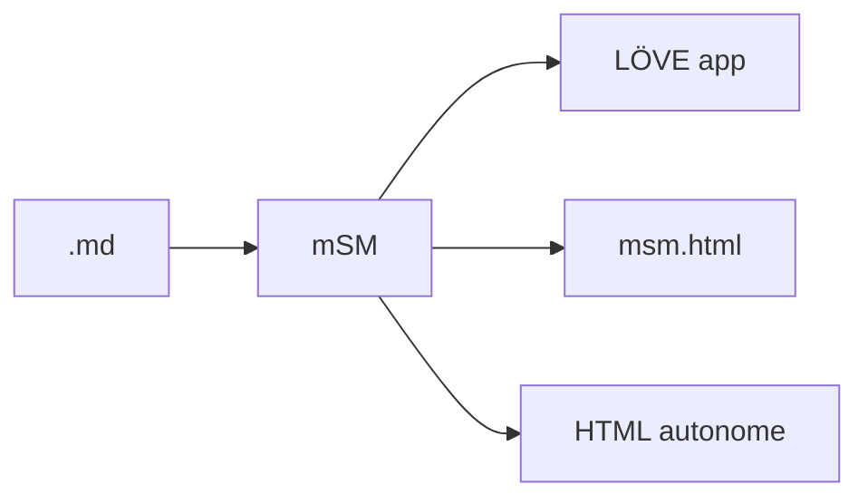

# mSM

### .md Slide Machine

Un moteur de présentation minimal, écrit en Lua

---

## Écris tes slides comme des notes

```markdown
# Titre
## Sous-titre

- Puce 1
- Puce 2


```

Un `.md` : un deck. Rien d'autre.

---

## Pourquoi mSM

- Un fichier `.md` versionnable dans Git
- Un runtime desktop léger (LÖVE + Lua)
- Un runtime web autonome (HTML unique)
- Export en HTML autonome (partageable par email, sans dépendance)

---

## Markdown inline

Tu peux écrire **du gras**, *de l'italique*, ~~du barré~~, du `code inline`, et des [liens cliquables](https://gitlab.com/xpoxpo/msm).

Ça marche dans le corps de texte comme dans les cellules de table.

---

## Tables avec formatage

| Feature       | Desktop | Web |
| ------------- | :-----: | :-: |
| **Markdown**  | oui     | oui |
| **Mermaid**   | oui     | oui |
| **Émojis**    | oui     | oui |
| *Export HTML* | `E`     | non |
| Édition live  | `Cmd-E` | non |

---

## Diagrammes Mermaid



Un bloc `mermaid`, mSM s'occupe du rendu.

---

## Raccourcis clavier

- `→` `Espace` `Entrée` : slide suivante
- `←` `Backspace` : précédente
- `O` : vue d'ensemble (mosaïque)
- `F` : plein écran
- `C` : notes de speaker
- `H` ou `?` : aide complète

Essaie `O` maintenant.

---

## Slides cachées

Ajoute `<!-- hidden: true -->` en tête d'une slide, elle sort du deck.

- `V` : bascule vue normale, vue cachées
- Utile pour garder des annexes "au chaud"

Puis en desktop : `Shift-H` cache, `Shift-U` réaffiche.

---

<!-- hidden: true -->
## Slide cachée

Cette slide n'apparaît pas en vue normale.

Appuie sur `V` pour la découvrir, puis à nouveau pour revenir.

---

## Thèmes et animations

- Templates dans `~/mSM/templates/`
- Fond animé : `mesh`, `aurora`, `grain`, `particles`, `static`
- Transitions : `fade`, `slide`, `push`
- Ken Burns automatique sur les images

Tout est configurable par slide ou pour le deck entier.

---

## Installation

**macOS (desktop) :**

```
Télécharge mSM.dmg depuis GitLab Releases
```

Signé Developer ID, notarisé Apple.

**Web :**

```
Ouvre msm.html?deck=ton-deck.md
```

Un seul fichier HTML, aucune dépendance.

---

## Open source

- Code : gitlab.com/xpoxpo/msm
- Écrit en Lua, ~2000 lignes
- Licence : MIT

Contribue, forke, adapte à ta guise.

---

# Merci

### Passe à `?` pour l'aide

Écrit avec mSM, présenté avec mSM.
